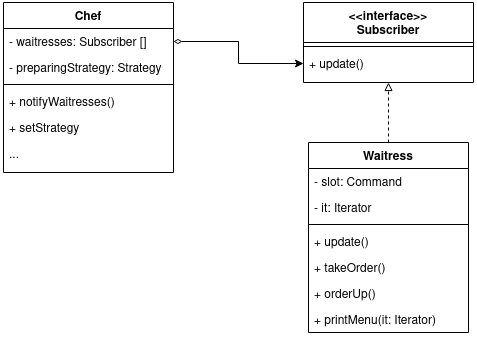
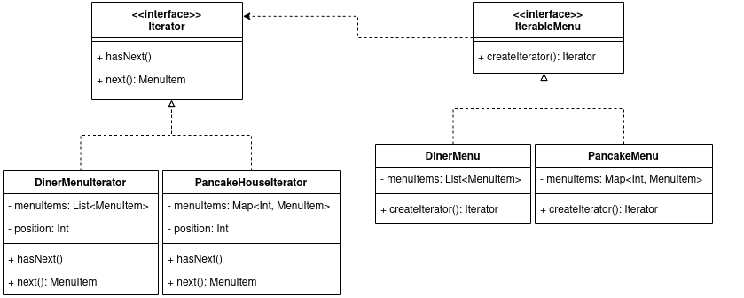
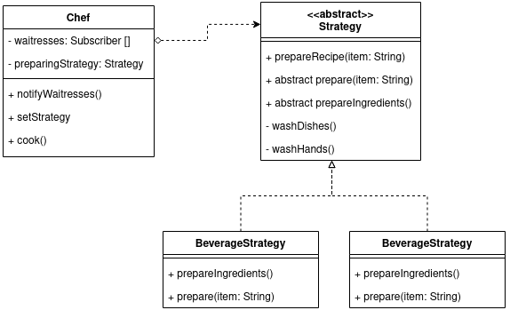
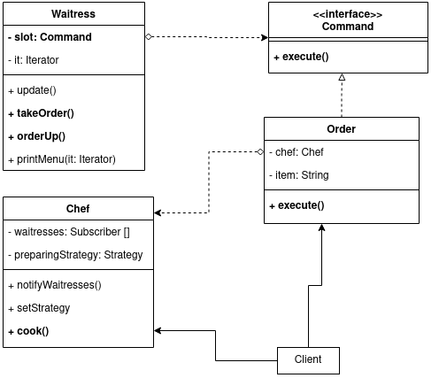

# Lab 4 Report

### Subject: Behavioral Design Patterns

### Author: Magal Vlada, FAF-203

## Objectives:

* Get familiar with the Behavioral Design Patterns;
* Implement at least 5 SDPs for a specific domain;

## Used Design Patterns:

* Observer
* Iterator
* Template
* Strategy
* Command

# Implementation

The following patterns are exemplified in a Cafe simulation, found in `lab4/cafe`. Run `CafeMain` to see the output.

## Observer

**Observer** is a behavioral design pattern that lets you 
define a subscription mechanism to notify multiple 
objects about any events that happen to the object they’re observing.

In this simulation, Observer is implemented as the `Chef`, who notifies the Subscribers (`Waitress`es).



The `Chef` notifies the `Subscriber`s like so:


```kt
class Chef(
    private val waitresses: MutableList<Subscriber>
) {
    // ...
    private fun notifyWaitresses(item: String) {
        for (w in waitresses) {
            w.update(item)
        }
    }
    // ...
}
```

## Iterator

**Iterator** is a behavioral design pattern that lets you traverse elements of a collection without exposing 
its underlying representation (list, stack, tree, etc.).

In this simulation, Iterator can be observed in the following classes:



Since `DinerMenu` and `PancakeMenu` have different representations of their menu items, 
a sensible choice was creating an `Iterator` which the Waitress could use to iterate
the menus without knowing how they're implemented.

The function `printMenu` in `Waitress` uses this Iterator to print the items:
```kt
    private fun printMenu(it: Iterator) {
        while(it.hasNext()) {
            println(it.next())
        }
    }
```

An example of Iterator:

```kt
class DinerMenuIterator(
    private val menuItems: List<MenuItem>
): Iterator {
    private var position: Int = 0
        set(value) { field = if (value >= 0) value else 0 }

    override fun hasNext(): Boolean {
        return position < menuItems.size
    }

    override fun next(): MenuItem {
        val item = menuItems[position]
        position += 1
        return item
    }

    override fun getItem(pos: Int): MenuItem {
        return if (pos < menuItems.size) menuItems[pos] else menuItems[0]
    }
}
```

## Template & Strategy
**Strategy** is a behavioral design pattern that lets you define a family of algorithms, put each of them into a separate 
class, and make their objects interchangeable.

**Template Method** is a behavioral design pattern that defines the skeleton of an algorithm in the superclass but lets 
subclasses override specific steps of the algorithm without changing its structure.



The Strategy pattern can observed in `Chef`, where, depending on the time of item received,
the Strategy can be switched dynamically:

```kt
    fun prepareFood(item: String) {
        when (item) {
            "Tea", "Coffee" -> {
                setStrategy(BeverageStrategy())
            }
            else -> {
                setStrategy(FoodStrategy())
            }
        }
        cook(item)
        notifyWaitresses(item)
    }
```
Then the Strategy set is used to actually prepare the food.

The **Template Method** Pattern is interwoven with the **Strategy**, as
it can be observed in the `Strategy` class.

```kt
abstract class Strategy {
    fun prepareRecipe(item: String) {
        washHands()
        prepareIngredients()
        prepare(item)
        washDishes()
    }

    private fun washDishes() {
        println("Turning on dish washing machine...")
    }

    abstract fun prepare(item: String)

    abstract fun prepareIngredients()

    private fun washHands() {
        println("Chef thouroughly washing his hands...")
    }
}
```
The template method is `prepareRecipe`, which has some common steps for all strategies,
such as `washDishes`, and some that are specific to either `FoodStrategy` or
`BeverageStrategy` and are thus overriden in their specific classes:

```kt
class FoodStrategy: Strategy() {
    override fun prepare(item: String) {
        println("Preparing meal $item...")
    }

    override fun prepareIngredients() {
        println("Preparing ingredients to cook meal...")
    }
}
```

## Command

Command is a behavioral design pattern that turns a request 
into a stand-alone object that contains all information 
about the request. This transformation lets you pass requests as a 
method arguments, delay or queue a request's execution, 
and support undoable operations.



As you can see from the UML diagram, the `Order` encapsulates a "request"
from a customer, such that the Waitress picking it up does not know or care
about who is going to prepare it, or how to handle it.

The Waitress only knows how to take an order (`takeOrder`), and 
how to post the order (`orderUp`). As you can see, the actual work
of executing the order is delegated to the order itself.
```kt
    fun takeOrder(order: Command) {
        println("Waitress $name has taken a order")
        slot = order
    }

    fun orderUp() {
        println("Waitress $name has posted the order...")
        slot?.execute()
    }
```

When the Waitress posts the order, the work is delegated to `execute()`,
which is further delegated to the "Receiver", in this case the Chef. Thus the
whole process of executing the order is encapsulated in itself, as neither
the Waitress or Chef have to know anything about it.

```kt
class Order(
    private val chef: Chef,
    private val item: String
): Command {

    override fun execute() {
        chef.prepareFood(item)
    }
}
```

# Conclusions
You can run this code in `CafeMain.kt` to use all the design patterns used in this lab.
The `Waitress` class uses the `Iterator` for printing the menus, `Command` for
taking orders and posting them to the `Chef` and is a "Subscriber" to the Chef as part of the `Observer` Pattern.

The `Chef` class uses the `Template` and `Strategy` Patterns to prepare the item.
```kt
fun main() {
    val dinerMenu = DinerMenu()
    val pancakeMenu = PancakeMenu()

    val waitress1 = Waitress("Claire", dinerMenu, pancakeMenu)
    val waitress2 = Waitress("Natalie", dinerMenu, pancakeMenu)
    val chef = Chef(mutableListOf(waitress1, waitress2))
    waitress1.printMenu()

    val order1 = Order(chef, "BLT")
    val order2 = Order(chef, "Tea")

    waitress1.takeOrder(order1)
    waitress1.orderUp()

    println("--------")

    waitress2.takeOrder(order2)
    waitress2.orderUp()
}
```

In this lab I understood 5 Behavioral Design Patterns and used them to create a Cafe simulation.